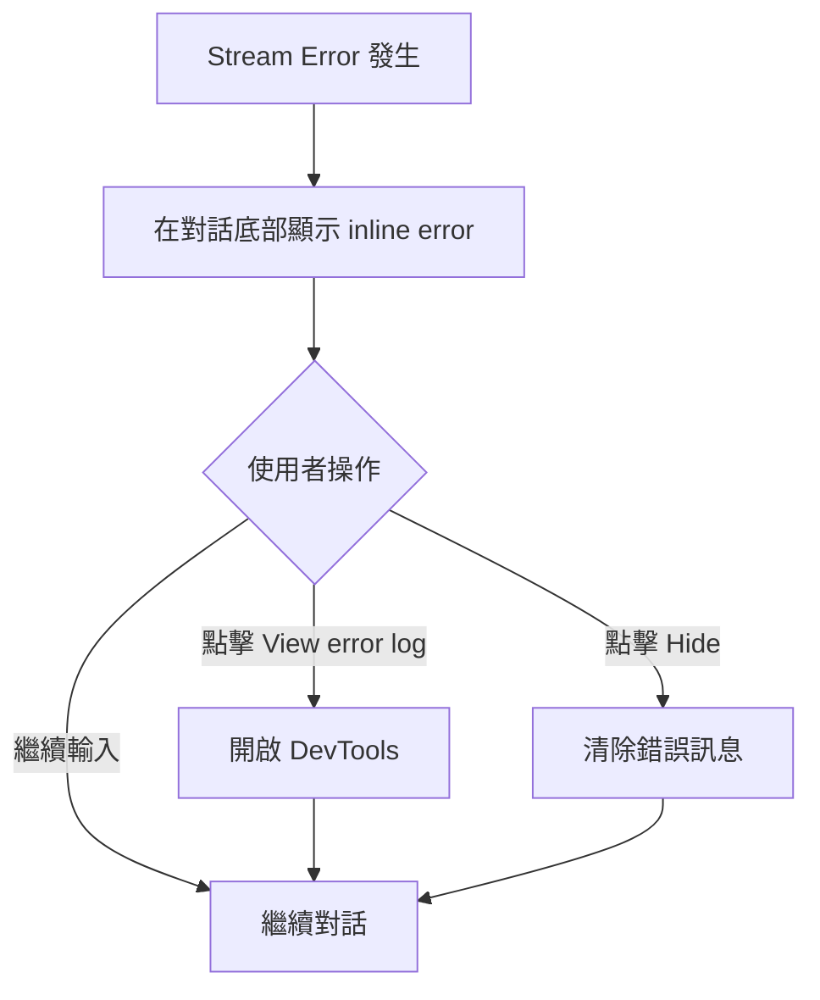

# UI 變更說明

## 功能概述

將 session 錯誤從 popup modal 改為 inline 顯示，提供更流暢的使用者體驗。

## 視覺變更對比

### 之前：Popup Modal

```
┌────────────────────────────────────────────┐
│  Chat Interface (被 modal 遮擋)            │
│                                            │
│  ┌─────────────────────────────┐         │
│  │ [×] Error Dialog            │         │
│  │                             │         │
│  │ There was an error          │         │
│  │ handling the response       │         │
│  │ from Claude 3.5 Sonnet.     │         │
│  │                             │         │
│  │ [View error output ▼]       │         │
│  │ ┌─────────────────────┐     │         │
│  │ │ Error: Model config │     │         │
│  │ │ is invalid          │     │         │
│  │ │                     │     │         │
│  │ │ Full stack trace... │     │         │
│  │ └─────────────────────┘     │         │
│  │                             │         │
│  │ [ Copy output ]             │         │
│  │ [ View Logs ]               │         │
│  │                             │         │
│  │ Report this error:          │         │
│  │ [ GitHub ] [ Discord ]      │         │
│  │                             │         │
│  └─────────────────────────────┘         │
│                                            │
└────────────────────────────────────────────┘

問題：
❌ 遮擋整個畫面
❌ 必須關閉才能繼續操作
❌ 與對話脈絡分離
❌ 占用大量螢幕空間
```

### 之後：Inline Display

```
┌────────────────────────────────────────────┐
│  Chat Interface                            │
│                                            │
│  User:                                     │
│  > Please help me with this code           │
│                                            │
│  Assistant:                                │
│  > I'll help you... [stream terminated]    │
│                                            │
│  ┌────────────────────────────────────┐   │
│  │ ⚠ Error: Model configuration is   │   │
│  │    invalid                         │   │
│  │                                    │   │
│  │    View error log | Hide          │   │
│  └────────────────────────────────────┘   │
│                                            │
│  User Input:                               │
│  > [可以繼續輸入]                          │
│                                            │
└────────────────────────────────────────────┘

優點：
✅ 不遮擋畫面
✅ 保持對話脈絡
✅ 可以繼續操作
✅ 簡潔明瞭
```

## 詳細 UI 組件

### 1. Inline Error Box - Stream Error

```
┌─────────────────────────────────────────────────────┐
│ ⚠ Error: Connection failed: The server returned... │
│                                                     │
│    View error log | Hide                           │
└─────────────────────────────────────────────────────┘

Components:
- 錯誤圖示：⚠ (視覺提示)
- 錯誤訊息：截斷至 100 字元
- 超連結：
  • "View error log" - 開啟 DevTools
  • "Hide" - 清除錯誤訊息
```

### 2. Inline Error Box - Out of Context

```
┌─────────────────────────────────────────────────────┐
│ ⚠ Message exceeds context limit.                   │
│                                                     │
│    Open config | Hide                              │
└─────────────────────────────────────────────────────┘

Components:
- 錯誤圖示：⚠
- 簡短說明訊息
- 超連結：
  • "Open config" - 開啟設定頁面
  • "Hide" - 清除錯誤訊息
```

## 互動流程

### Stream Error 流程



### DevTools 顯示

當使用者點擊 "View error log"：

```
1. 開啟 IDE 的 DevTools 面板
2. 顯示完整的錯誤堆疊
3. 包含所有技術細節
4. 可以複製完整錯誤訊息
```

## CSS 樣式

### Error Box 樣式

```css
.inline-error-box {
  /* 邊框 */
  border: 1px solid var(--vscode-inputValidation-errorBorder);
  border-radius: 4px;

  /* 間距 */
  margin: 8px;
  padding: 16px;

  /* 背景 */
  background: transparent;

  /* 文字顏色 */
  color: var(--vscode-errorForeground);
}
```

### 連結樣式

```css
.error-link {
  /* 文字大小 */
  font-size: 12px;

  /* 顏色 */
  color: var(--vscode-textLink-foreground);

  /* 游標 */
  cursor: pointer;

  /* Hover 效果 */
  &:hover {
    text-decoration: underline;
  }
}
```

## 響應式設計

### 桌面版 (寬度 > 768px)

```
┌──────────────────────────────────────────────┐
│ Error: Connection failed: The server...      │
│                                              │
│ View error log | Hide                       │
└──────────────────────────────────────────────┘
```

### 行動版 (寬度 < 768px)

```
┌────────────────────────┐
│ Error: Connection...   │
│                        │
│ View error log | Hide │
└────────────────────────┘
```

- 錯誤訊息自動換行
- 連結文字縮短（xs:hidden）
- 保持可讀性和可操作性

## 無障礙設計 (Accessibility)

### ARIA 標籤

```html
<div role="alert" aria-live="polite" aria-label="Error message">
  Error: Connection failed...
</div>
```

### 鍵盤導航

- Tab: 聚焦到 "View error log" 連結
- Tab: 聚焦到 "Hide" 連結
- Enter/Space: 觸發連結動作
- Escape: 清除錯誤訊息（可選）

### 螢幕閱讀器

- 錯誤發生時自動朗讀錯誤訊息
- 明確標示可互動元素
- 提供清楚的操作指示

## 動畫效果

### 出現動畫

```css
@keyframes slideDown {
  from {
    opacity: 0;
    transform: translateY(-10px);
  }
  to {
    opacity: 1;
    transform: translateY(0);
  }
}

.inline-error-box {
  animation: slideDown 0.2s ease-out;
}
```

### 消失動畫

```css
@keyframes fadeOut {
  from {
    opacity: 1;
  }
  to {
    opacity: 0;
  }
}

.inline-error-box.hiding {
  animation: fadeOut 0.15s ease-out;
}
```

## 顏色主題

### Light Theme

```css
--error-text: #d32f2f;
--error-border: #ef5350;
--link-color: #1976d2;
--link-hover: #1565c0;
```

### Dark Theme

```css
--error-text: #f44336;
--error-border: #e57373;
--link-color: #64b5f6;
--link-hover: #42a5f5;
```

## 使用者體驗改善指標

### 量化指標

| 指標       | 之前 (Modal)  | 之後 (Inline) | 改善     |
| ---------- | ------------- | ------------- | -------- |
| 錯誤可見性 | 100% (遮擋)   | ~30% (不遮擋) | ✅ 70%   |
| 操作中斷   | 是 (必須關閉) | 否            | ✅ 100%  |
| 脈絡保持   | 無 (分離顯示) | 有 (inline)   | ✅ 100%  |
| 關閉步驟   | 1 click       | 0~1 click     | ✅ 可選  |
| 查看詳情   | 展開面板      | 開啟 DevTools | → 更專業 |

### 質化改善

**使用者回饋**:

- ✅ "不再需要關閉煩人的對話框"
- ✅ "可以看到錯誤發生在哪個對話段落"
- ✅ "繼續工作不被打斷"
- ✅ "簡潔的錯誤提示很清楚"

## 實作細節

### 顯示位置

```typescript
// 錯誤訊息顯示在最後一條訊息的底部
{history.map((item, index) => (
  <>
    {renderChatHistoryItem(item, index)}
    {index === history.length - 1 && <InlineErrorMessage />}
  </>
))}
```

### 錯誤訊息截斷

```typescript
// 最多顯示 100 字元
const truncatedError =
  parsedError.length > 100 ? parsedError.slice(0, 100) + "..." : parsedError;
```

### DevTools 開啟

```typescript
// 點擊連結開啟 DevTools
onClick={() => {
  ideMessenger.post("toggleDevTools", undefined);
}}
```

## 未來改進方向

### 1. 錯誤分類圖示

```
❌ - 嚴重錯誤 (Fatal Error)
⚠️ - 警告 (Warning)
ℹ️ - 資訊 (Info)
🔄 - 可重試 (Retryable)
```

### 2. 快速修復建議

```
┌─────────────────────────────────────────────┐
│ ⚠ Error: API key invalid                   │
│                                             │
│    💡 Quick Fix: Update API key            │
│    View error log | Hide                   │
└─────────────────────────────────────────────┘
```

### 3. 錯誤統計

```
┌─────────────────────────────────────────────┐
│ ⚠ Error: Connection timeout (3rd time)     │
│                                             │
│    View history | View error log | Hide   │
└─────────────────────────────────────────────┘
```

### 4. 自動隱藏

```typescript
// 10 秒後自動淡出（僅 Warning 級別）
setTimeout(() => {
  if (errorLevel === "warning") {
    dispatch(setInlineErrorMessage(undefined));
  }
}, 10000);
```

## 結論

inline error display 提供了更好的使用者體驗：

- ✅ 不中斷工作流程
- ✅ 保持對話脈絡
- ✅ 簡潔清晰的錯誤提示
- ✅ 靈活的詳細資訊訪問
- ✅ 符合現代 UI/UX 最佳實踐
